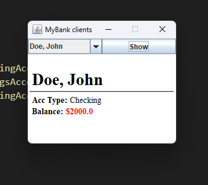
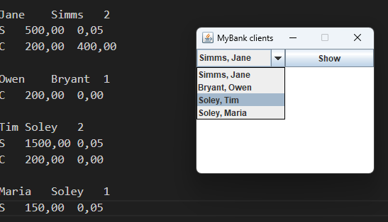
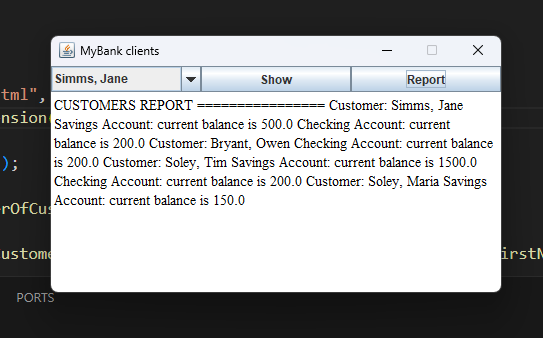

# UI Lab 3
## MyBank
### Завдання
<b>Завантажте jar-файл з усіма потрібними классами (Bank, Customer, Account та ін.) з наших попередніх лаб - MyBank
Створіть в Netbeans новий проект з назвою GUIdemo (або використайте проект, створений в ході виконання попередньої роботи). УВАГА! Чекбокс Create Main Class треба очистити (не створювати виконуваний клас)!
Додайте до проекту завантажену вами бібліотеку - правою кнопкой на проекті, обрати Properties, потім у дереві категорій обрати Libraries (другий пункт зверху), натиснути у правій частині вікна кнопку Add JAR/Folder, обрати jar-файл, завантажений у п. 1, натиснути Ok
Додайте до проекту файл SWINGdemo.java з цього репозиторію.</b>

### Результат

## test.dat
### Завдання
<b>Перепишіть код так, щоб інформація про клієнтів банку та їх рахунки читалась з файлу test.dat.</b>

### Результат
 

## Report
### Завдання
<b>Додайте ще одну кнопку - Report, яка має виводити у нижній частині вікна звіт за клієнтами</b>

### Результат
